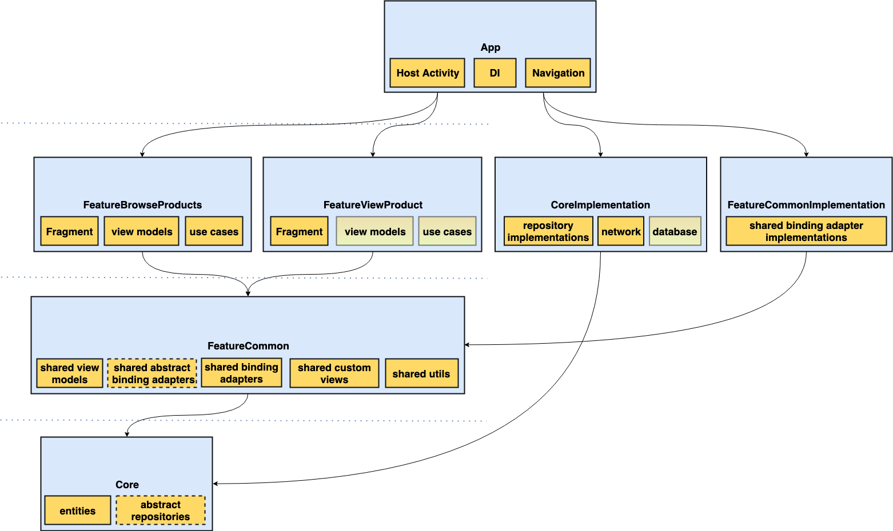

# Mini Mercari App

## Tech Stack
- Main
  - [Architecture components ViewModel](https://developer.android.com/topic/libraries/architecture/viewmodel)
  - [Android data binding library](https://developer.android.com/topic/libraries/data-binding)
  - [Navigation architecture component](https://developer.android.com/guide/navigation)
  - [Koin](https://insert-koin.io/)
  - [Retrofit](https://square.github.io/retrofit/)
  - [Moshi](https://github.com/square/moshi)
  - [Glide](https://bumptech.github.io/glide/)
  - [Kotlin Coroutines](https://kotlinlang.org/docs/reference/coroutines-overview.html)
  - [Toolbox](https://github.com/Aidanvii7/Toolbox)
- Testing
  - [JUnit5](https://junit.org/junit5/)
  - [Mockito Kotlin](https://github.com/nhaarman/mockito-kotlin)
  - [Kluent](https://github.com/MarkusAmshove/Kluent)

## Demo
[Download the apk](https://drive.google.com/file/d/1Ku1ao3rtsh-CKEBxd7IQuP8Ef3xgDd3B/view?usp=sharing)

[Demo video](https://drive.google.com/file/d/1ulvImdZRU_GLRDvlN7qhqGQxrs9RnYDP/view?usp=sharing)

## Architecture
The proposed solution uses a modularised approach in order to promote separation of concerns throughout the app.
It uses a mixture of separation by layer and separation by feature.
The following diagram shows each of the main modules in the app, and how they are connected:

### App module
The main [App module](app) at the top is responsible for:
- The application implementation ([MercariApp](app/src/main/java/com/mercariapp/mercari/MercariApp.kt))
- hosting the navigation based activity ([MainActivity](app/src/main/java/com/mercariapp/mercari/presentation/MainActivity.kt))
- Initialising the dependency graph using [Koin](https://insert-koin.io/)
- Providing navigation facilities using the [Navigation architecture component](https://developer.android.com/guide/navigation)

### Core module
The [Core module](Core) simply contains the high level business rules that are common throughout the app such as:
- A model object for describing a [product category](Core/src/main/java/com/mercariapp/core/domain/ProductCategory.kt)
- A model object for describing a [product](Core/src/main/java/com/mercariapp/core/domain/Product.kt)
- A [repository interface](Core/src/main/java/com/mercariapp/core/domain/ProductRepository.kt) that provides the afformentioned model objects

### CoreImplementation module
The [CoreImplementation module](CoreImplementation) is responsible for:
- Defining the implementations of repositories from the [Core module](Core), currently only [ProductRepositoryImpl](CoreImplementation/src/main/java/com/mercariapp/core/implementation/domain/ProductRepositoryImpl.kt)
- Isolating dependencies on frameworks that are required to provide data, such as:
  - which http client to use (if any)
  - which database to use (if any)
  - which serialisation library to (if any)

The current implementation uses Retrofit for retrieving the product categories and subsequently products from the provided endpoint (https://s3-ap-northeast-1.amazonaws.com/m-et/Android/json/master.json). The main benefit of this approach is the ability to swap-out implementations in future if necessary, such as:
- Switching the networking implementation to use GraphQL, GRPC, Firebase, FireStore, etc..
- Switching the database implementation to use Realm, ObjectBox, Room, etc..

As the app would become more complex over time, both [Core](Core) and [CoreImplementation](CoreImplementation) could be subdivided further.

### FeatureCommon
The [FeatureCommon module](FeatureCommon) is responsible for:
- Providing a basic [ProductViewModel](FeatureCommon/src/main/java/com/mercariapp/feature/common/presentation/ProductViewModel.kt) for a [Product](Core/src/main/java/com/mercariapp/core/domain/Product.kt) that may be used in any feature module
- Providing commonly used binding adapters to other feature modules for handling:
  - Visibility of views ([ViewVisibilityBindingAdapters](FeatureCommon/src/main/java/com/mercariapp/feature/common/databinding/ViewVisibilityBindingAdapters.kt))
  - Integration with the standard `SwipeRefreshLayout` ([SwipeRefreshLayoutBindingAdapters](FeatureCommon/src/main/java/com/mercariapp/feature/common/databinding/SwipeRefreshLayoutBindingAdapters.kt)) for:
    - Changing it's refreshing state
    - Styling the loading spinner 
  - Loading of images into an `ImageView` via an abstract (non-static) binding adapter ([ImageViewBindingAdapters](FeatureCommon/src/main/java/com/mercariapp/feature/common/databinding/ImageViewBindingAdapters.kt))
    - This is abstract to keep dependencies on image loading frameworks like Glide or Picasso away from feature modules
  - Click events via an abstract binding adapter, and passing data through them such as which [product](Core/src/main/java/com/mercariapp/core/domain/Product.kt) was clicked.
    - This is abstract to allow the [App module](app) to decide how to handle the event, in this case to navigate to another feature screen
    
### FeatureBrowseProducts module
The [FeatureBrowseProducts module](FeatureBrowseProducts) is responsible for providing the [BrowseProductsFragment](FeatureBrowseProducts/src/main/java/com/mercariapp/feature/browseproducts/presentation/BrowseProductsFragment.kt)
that hosts the UI and associated view models required to browse through products in each category. 

The main view model, [ProductCategoriesViewModel](FeatureBrowseProducts/src/main/java/com/mercariapp/feature/browseproducts/presentation/ProductCategoriesViewModel.kt) is responsible for:
- Retrieving product categories via use cases
- Exposing the loading state of retrieving categories to a `ProgressBar`
- Exposing the product categories to a `ViewPager`

It is a [Architecture components ViewModel](https://developer.android.com/topic/libraries/architecture/viewmodel) that is scoped to the instance of the fragment's host activity. It doesn't use the API for retrieving view models directly, instead it uses Koin's [ViewModel extension](https://insert-koin.io/docs/2.0/getting-started/android-viewmodel), which uses the standard `ViewModelProvider` api under the hood. The reasoning for using this is because it vastly simplifies retrieval of view models from a `ViewModelProvider`, and more importantly allows view model instances and their dependencies to be resolved through Koin. 

The second view model, [ProductCategoryViewModel](FeatureBrowseProducts/src/main/java/com/mercariapp/feature/browseproducts/presentation/ProductCategoryViewModel.kt)
is responsible for:
- Retrieving products for a given product category via use cases
- Exposing the loading state of retrieving a category to a `SwipeRefreshLayout`
- Exposing placeholder items to a `RecyclerView` while loading
- Exposing the product categories to a `RecyclerView` once loaded
- Exposing a refresh mechanism used by the `SwipeRefreshLayout`

It is very similar in implementation to [ProductCategoriesViewModel](FeatureBrowseProducts/src/main/java/com/mercariapp/feature/browseproducts/presentation/ProductCategoriesViewModel.kt), however it is *not* an [Architecture components ViewModel](https://developer.android.com/topic/libraries/architecture/viewmodel). This is because these view models are owned by the parent [ProductCategoriesViewModel](FeatureBrowseProducts/src/main/java/com/mercariapp/feature/browseproducts/presentation/ProductCategoriesViewModel.kt).
Instances of [ProductCategoryViewModel](FeatureBrowseProducts/src/main/java/com/mercariapp/feature/browseproducts/presentation/ProductCategoryViewModel.kt) are also created with Koin.

Both of these view models require a [repository interface](Core/src/main/java/com/mercariapp/core/domain/ProductRepository.kt) implementation which is provided by the [App](app) module via Koin.

### FeatureViewProduct module (bonus feature)
The [FeatureViewProduct module](FeatureViewProduct) was not part of the requirements, but simply a test of how subsequent features might interact with each other. In this case, to test navigation to another 'feature'. There is nothing special in this screen, it simply displays the product photo enlarged. Navigation to this feature screen is done through a binding adapter.

### FeatureCommonImplementation module
The [FeatureCommonImplementation module](FeatureCommonImplementation) is responsible for for 'filling in the gaps' in the [FeatureCommon module](FeatureCommon), such as providing concrete implementations of abstractions. Currently this is only providing a concrete implementation of [ImageViewBindingAdapters](FeatureCommon/src/main/java/com/mercariapp/feature/common/databinding/ImageViewBindingAdapters.kt) that uses Glide ([GlideImageViewBindingAdapters](FeatureCommonImplementation/src/main/java/com/mercariapp/feature/common/implementation/databinding/GlideImageViewBindingAdapters.kt)).

Similarly to [CoreImplementation](CoreImplementation), this module could be subdivided further as the app grows over time.
